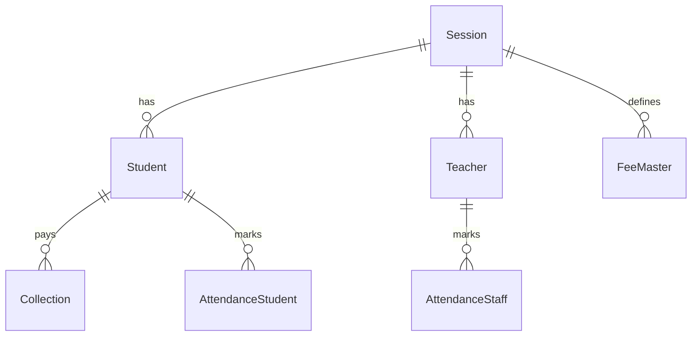

# 🏫 Coaching Management System

> A comprehensive school management system built with Next.js, Prisma, and MongoDB

This document describes the **full requirements**, **data model**, and **MVP scope** of the Coaching Management System.  
The implementation is based on **Next.js (App Router)**, **Server Actions**, and **shadcn/ui** with theming conventions.

---

# 1. 📌 Full Requirements

### Session Management

-   Annual sessions (2025, 2026, 2027…)
-   Session auto-close → lock all related data
-   New session = fresh setup for class, section, roll, fees

### Student Information

-   Admission
-   Student profile (attractive UI)
-   Student categories (color-coded)
-   Active/Inactive/Disabled status
-   Disable reason
-   Staff-only Notes/Diary
-   Continuity tick (for next session admission)
-   Delete student

### Fee Collection

-   Collect by Student ID or batch
-   Fee master, fee group, fee type
-   Discounts
-   Pending approval workflow → Admin approves → Receipt generated

### Income & Expense

-   Add income, add expense
-   Daily total income/expense
-   Reports: monthly, yearly balance

### Examination

-   Exam group & schedule
-   Exam categories
-   Marks entry & ranking
-   Student categories with hidden behavioral notes
-   Result processing & continuity selection

### Attendance

-   Student attendance by date
-   Teacher/staff attendance
-   Daily summary & monthly reports

### Academic

-   Batch time setting
-   Teacher time setting
-   Holiday calendar
-   Assign class teacher
-   Subject, class, batch, section, roll management

### Teacher / Staff

-   Staff directory
-   Staff attendance
-   Leave apply & approve
-   Leave type
-   Designation
-   Disable staff
-   Assign subject
-   Increment report
-   Teacher dashboard with class plan, tests, notices

### Communication

-   Notice board
-   SMS (all students, absentees, low scorers, staff, subject teachers)
-   Due list SMS
-   SMS history
-   SMS purchase
-   SMS templates

### Website Activities

-   Events
-   Gallery
-   News

### Routine Management

-   Admin creates routine template
-   Teachers submit routine
-   View class routine (by school/class/subject)

### Payroll

-   Salary setup
-   Advance salary
-   Salary report

### Office Operations

-   Assigned school responsibilities
-   School-wise syllabus
-   Notes repository
-   Question papers
-   Class test creation
-   Model test creation
-   Class plan creation

### Reports

-   Student info reports (gender ratio, guardian list, admission trends)
-   Finance reports (daily collection, income/expense, dues, yearly balance, payroll)
-   Attendance reports (daily, monthly, staff)
-   Exam reports (schedule, ranking, marks, results)
-   User logs
-   Monthly report cards (attendance, fees, tests, remarks, print/export)
-   SMS reports

---

# 2. 🎯 MVP Scope

For the first release (MVP), focus on:

1. **Dashboard**

    - Summary cards (Total students, Active teachers, Pending fees, Today’s attendance)
    - Charts: admission trends, collection vs expense, attendance %
    - Notifications (due alerts, notes)

2. **Students**

    - CRUD (Add, Edit, Delete, View)
    - Profile with tabs (Overview | Guardian | Attendance | Fees | Notes)
    - Notes (staff-only)
    - Search by class, batch, session

3. **Teachers**

    - CRUD (Add, Edit, Disable, View)
    - Profile (subjects, salary, leaves, dashboard info)
    - Leave management (apply & approve)

4. **Attendance**

    - Student attendance (by batch, by date)
    - Staff attendance
    - Reports (daily summary, monthly %)

5. **Reports**
    - Student reports (guardian list, gender ratio)
    - Attendance reports (daily/monthly)
    - Finance reports (daily collection, pending dues)
    - Export/Print (PDF/Excel)

---

# 3. 📂 Data Model

### Session

-   `id`, `year`, `status (active/closed)`
-   `createdAt`, `updatedAt`

### Student

-   `id`, `studentId`, `sessionId`
-   `classId`, `batchId`, `sectionId`, `roll`
-   `personal` { nameBn, nameEn, dob, gender, bloodGroup, photoUrl }
-   `guardian` { fatherName, motherName, occupations, contact { smsNo, altNo, email } }
-   `address` { present, permanent }
-   `status (active/inactive/disabled)`
-   `disableReason`
-   `notes[]` { staffId, note, createdAt }
-   `continuityTick` (bool)
-   `createdAt`, `updatedAt`

### Teacher / Staff

-   `id`, `staffId`, `sessionId`
-   `personal` { nameBn, nameEn, dob, gender, bloodGroup }
-   `contact` { mobile, email, facebook }
-   `address` { present, permanent }
-   `designation`
-   `subjects[]`
-   `qualification`, `experience`
-   `salaryInfo` { basicSalary, allowances{}, advanceTaken }
-   `status`
-   `incrementHistory[]`
-   `leaveInfo[]`
-   `dashboard` { attendanceSummary, classTestsTaken }
-   `createdAt`, `updatedAt`

### Attendance

-   Student: { id, studentId, sessionId, batchId, date, status, markedBy }
-   Staff: { id, staffId, date, status }

### Fees & Collections

-   FeeMaster: { id, sessionId, name, amount, type, groupId, dueDate }
-   Collection: { id, studentId, sessionId, amount, method, status, collectedBy, receiptNo }

---

# 4. 🔗 Relationships



---

# 5. 🏗️ Implementation Status

## ✅ Completed

### Database Layer
- **Prisma Schema**: Complete MongoDB schema with proper relationships
- **Database Queries**: Full CRUD operations for all entities
- **Type Definitions**: Comprehensive TypeScript types

### Query Functions (`/queries/`)
- **Dashboard**: Summary stats, charts data, notifications
- **Students**: CRUD, notes, reports, filtering
- **Teachers**: CRUD, leave management, dashboard data
- **Attendance**: Student/staff attendance, batch marking, reports
- **Reports**: Student info, finance, attendance, export functionality
- **Utilities**: Session management, academic structure, fee management

### UI Components (`/components/`)
- **Dashboard**: Summary cards, charts, notifications
- **Tables**: Data tables with sorting, filtering, pagination
- **Forms**: Student/teacher forms with validation
- **UI Library**: Complete shadcn/ui component set

### Pages (`/app/dashboard/`)
- **Dashboard**: Main overview with statistics
- **Students**: Student management with tabs
- **Teachers**: Teacher management with profiles
- **Attendance**: Attendance tracking interface
- **Reports**: Comprehensive reporting system

## 🚧 In Progress
- Fee collection workflow
- Advanced reporting features
- Export/print functionality

## 📋 TODO
- Authentication system
- SMS integration
- Examination module
- Payroll system

---

# 6. 📁 Project Structure

```
attendance-management/
├── app/                    # Next.js App Router
│   ├── api/               # API routes
│   ├── dashboard/         # Dashboard pages
│   │   ├── students/      # Student management
│   │   ├── teachers/      # Teacher management
│   │   ├── attendance/    # Attendance tracking
│   │   └── reports/       # Reports & analytics
│   └── globals.css        # Global styles
├── components/            # Reusable UI components
│   ├── Dashboard/         # Dashboard-specific components
│   ├── Table/            # Data table components
│   └── ui/               # shadcn/ui components
├── queries/              # Database query functions
│   ├── dashboard.ts      # Dashboard queries
│   ├── student.ts        # Student CRUD operations
│   ├── teacher.ts        # Teacher CRUD operations
│   ├── attendance.ts     # Attendance operations
│   ├── report.ts         # Reporting queries
│   └── index.ts          # Utility queries
├── types/                # TypeScript type definitions
│   ├── student.ts        # Student-related types
│   ├── teacher.ts        # Teacher-related types
│   ├── attendance.ts     # Attendance types
│   ├── fee.ts           # Fee management types
│   └── index.ts         # Type exports
├── lib/                  # Utility libraries
│   ├── prisma.ts        # Prisma client
│   ├── utils.ts         # Helper functions
│   └── auth.ts          # Authentication
├── prisma/              # Database schema
│   └── schema.prisma    # Prisma schema definition
└── hooks/               # Custom React hooks
```

---

# 7. 🔧 Development Guidelines

## Database Queries
- All queries are in `/queries/` directory
- Use proper TypeScript types from `/types/`
- Follow CRUD pattern: Create, Read, Update, Delete
- Include proper error handling and validation

## Type Safety
- All database operations use TypeScript types
- Form data validation with proper interfaces
- Consistent naming conventions

## Component Structure
- Reusable components in `/components/`
- Page-specific components in respective page directories
- Use shadcn/ui for consistent design system

## Query Usage Examples

```typescript
// Student operations
import { createStudent, getStudents, updateStudent } from '@/queries'

// Create new student
const student = await createStudent({
  studentId: 'STU001',
  sessionId: 'session-id',
  personal: { nameEn: 'John Doe', ... },
  // ... other fields
})

// Get students with filters
const students = await getStudents('session-id', {
  classId: 'class-id',
  status: 'ACTIVE',
  search: 'john'
})
```

---

# 8. 📝 Recent Updates

**Latest Update**: Database queries implementation with proper TypeScript types
- ✅ Updated all query functions to use defined types
- ✅ Improved type safety across the application
- ✅ Added comprehensive CRUD operations for all entities
- ✅ Implemented filtering and search functionality
- ✅ Added proper error handling and validation

**Next Steps**: 
- Implement server actions for form handling
- Add authentication middleware
- Create export/print functionality
- Integrate SMS service
